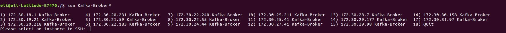

# sshAmazonTagName

Description

ssh directly into servers by amazon tag name instead using IP/DNS.


Configuration
Copy the searchAmazon code into the end of ~/.bashrc file.


````searchAmazon() {
        aws ec2 describe-instances --filters "Name=tag:Name,Values=$*" --output text --query 'Reservations[].Instances[].[PrivateIpAddress,Tags[?Key==`Name`].Value[]]' | sed 's/None$/None\n/' | sed '$!N;s/\n/ /' | sort -k2 -V > /tmp/aws.txt
        prompt="Please select an instance to SSH: "
        mapfile -t < /tmp/aws.txt options

       PS3="$prompt"
       echo $mapfile
        select opt in "${options[@]}" "Quit" ; do
            if (( REPLY == 1 + ${#options[@]} )) ; then
                exit

           elif (( REPLY > 0 && REPLY <= ${#options[@]} )) ; then
                ssh $(echo $opt | awk '{ print $1 }')
                break

           else
                echo "Invalid option. Try another one."
            fi
        done
}
alias ssa=searchAmazon
````

The ```ssa=searchAmazon```  is simple alias, you can change it to whatever you wants.

Usage:
```eli@eli-Latitude-E7470:/$ ssa Kafka-Broker*```  (You can use asterisk (*) wildcard to do the query more globaly)


Screenshot:



# CsshAmazonTagName

Description

Clusrer ssh directly into servers by amazon tag name instead using IP/DNS.


Configuration
Copy the searchAmazon2 code into the end of ~/.bashrc file.


* requirement install cssh / cluster-ssh

```searchAmazon2() {
        aws ec2 describe-instances --filters "Name=tag:Name,Values=$*" --output text --query 'Reservations[].Instances[].[PrivateIpAddress]' > /tmp/aws.txt
        cssh `cat /tmp/aws.txt | grep -v None`

}
alias cssa=searchAmazon2```

Usage:
```eli@eli-Latitude-E7470:/$ cssa Kafka-Broker*```  (You can use asterisk (*) wildcard to do the query more globaly)

